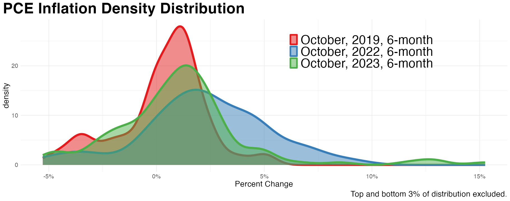

```{r setup, include=FALSE}
knitr::opts_chunk$set(echo = FALSE, warning = FALSE, message = FALSE)
library(tidyverse)
library(quantmod)
library(lubridate)
library(knitr)
library(scales)
library(lubridate)
library(ggrepel)
library(kableExtra)
library(stargazer)
library(scales)
source("slide_code/0_helper_functions.R")

colorize <- function(x, color) {
  if (knitr::is_latex_output()) {
    sprintf("\\textcolor{%s}{%s}", color, x)
  } else if (knitr::is_html_output()) {
    sprintf("<span style='color: %s;'>%s</span>", color,
      x)
  } else x
}
```

## Overview

### What just happened?

This presentation takes a tour through the wild swings in what people thought about inflation following the pandemic.

1.  Transitory Inflation in 2021

2.  Persistent Inflation in 2022

3.  The Great Disinflation of 2023

4.  Remaining Questions

It finds that the large majority of the disinflation in 2023 was driven by supply-side expansion, consistent with inflation driven by reopening pressures.

# But First: Recap

## But First: Recap

### Historic disinflation - since 2021

Inflation falls dramatically, while unemployment is below 4 percent the last two years.

```{r first graphic, fig.height=5.5, fig.width=10, fig.align='center'}

source("slide_code/slide_1.R")
slide1
```

## But First: Recap

### Historic disinflation - since 1961

We haven't seen this level of disinflation without much higher unemployment recently.

```{r slide2, fig.height=5.5, fig.width=10, fig.align='center'}
source("slide_code/slide_2.R")
slide2
```

## But First: Recap

### Historic disinflation - not since late 1940s and early 1950s

A period also remembered for reopenings and supply chains; this was the original comparison point in 2021.

```{r slide3, fig.height=5.5, fig.width=10, fig.align='center'}
source("slide_code/slide_3.R")
slide3
```

# Transitory Inflation in 2021

## Transitory Inflation in 2021

### Federal Reserve and *Transitory*

\small

Soon to become a political liability, the term circulates from FOMC statements.

::: columns
::: column
"The sectors most adversely affected by the pandemic remain weak but have shown improvement. Inflation has risen, `r colorize("largely reflecting transitory factors", "teal")`."

FOMC statement, April 2021
:::

::: column
"Inflation is elevated, largely reflecting `r colorize("factors that are expected to be transitory", "teal")`. Supply and demand imbalances related to the pandemic and the reopening of the economy have contributed to sizable price increases in some sectors."

FOMC statement, November 2021
:::
:::

## Transitory Inflation in 2021

\small

### Federal Reserve and *Transitory*

Treated as a pandemic recovery neologism, 'transitory' is actually an older *Fedspeak* term.

::: columns
::: column
"This framework suggests, first, that much of the recent shortfall of inflation from our 2 percent objective is attributable to special factors whose effects are `r colorize("likely to prove transitory", "teal")`."

Chair Yellen, September 2015
:::

::: column
"Inflation will probably run a bit below our objective for a time due to declines in energy prices, but those effects are `r colorize("likely to prove transitory", "teal")`."

Chair Powell, March 2019
:::
:::

## Transitory Inflation in 2021

### What was transitory inflation?

In 2021, it was the idea that inflation would be:

-   confined to pandemic-impacted sectors

-   limited to outliers, and not impacting e.g. trimmed mean PCE or median CPI

-   driven by the shift into goods from services; goods would come down with services contained

-   Driven by cyclically insensitive categories, not by e.g. 'cyclically sensitive inflation'

## Transitory Inflation in 2021

### Was it plausible?

After pandemic, major shift in spending from services to goods.

```{r shift_chart, fig.height=5, fig.width=10, fig.align='center'}
source("slide_code/slide_goods_services.R")
graphic_shift
```

## Transitory Inflation in 2021

### Was it plausible?

Within 2021, inflation did look uniquely contained to goods.

```{r stacked_chart, fig.height=5, fig.width=10, fig.align='center'}
source("slide_code/slide_stacked.R")
stacked_chart
```

## Transitory Inflation in 2021

### What happened?

| Year over Year Change          | 2019 | August, 2021 |
|--------------------------------|------|--------------|
| Trimmed Mean PCE               | 2    | 2.3          |
| Core CPI Services              | 3.1  | 2.7          |
| Cyclically-sensitive inflation | 2    | 3.1          |
|                                |      | Yay!         |

## Transitory Inflation in 2021

### What happened?

| Year over Year Change          | 2019 | August, 2021 | August, 2022 |
|--------------------------------|------|--------------|--------------|
| Trimmed Mean PCE               | 2    | 2.3          | 4.7          |
| Core CPI Services              | 3.1  | 2.7          | 6.1          |
| Cyclically-sensitive inflation | 2    | 3.1          | 6.5          |
|                                |      | Yay!         | Yikes!       |

# Persistent Inflation in 2022

## Persistent Inflation in 2022

### Will expectations save us?

Take one Federal Reserve specification of the Phillips Curve (Yellen 2015):

$$
\pi_{t} = \pi_{t-1} + \pi_{t-2} + \pi^{e}_{t} + \beta(u - u^*)
$$

Inflation is modeled on past and future expected inflation, plus deviations from potential output.

-   But, what years to train the data on?

## Persistent Inflation in 2022

If we start the data in the 1970s, the Great Inflation, it says inflation in 2022 is entrenched.

If we start the data in the 1990s, the Great Moderation, it says inflation should be lower.

```{r pc_slide, fig.height=5, fig.width=10, fig.align='center'}
source("slide_code/slide_pc.R")
slide_pc
```

## Persistent Inflation in 2022

::: columns
::: column
-   If we ask the Phillips Curve if inflation is persistent or guided by expectations, it says it depends if we're still in the Great Moderation or not.

-   But that's the question we're asking!

-   Significant $\beta(u-u^*)$ on 1970s model would mean large unemployment to bring inflation down.
:::

::: column
```{r pc_models_setup, include=FALSE}
star_model = stargazer(model, model2, type = "latex", column.labels = c("1992-2019","1971-2019"), dep.var.labels = c("$\\pi$"),
                        header=FALSE, title = "",
                        covariate.labels = c("$\\pi_{t-1}$", "$\\pi_{t-2}$", "$\\pi^e_t$", "$(u - u^*)$"),
                        no.space = TRUE, omit.stat=c("f", "ser"),
                        column.sep.width = "3pt",
                        font.size = "tiny")
star_model = sub('^.+\\caption.+$','', star_model)
```

```{r mylatextable, results = "asis"}
cat(star_model, sep='\n')
```
:::
:::

## Persistent Inflation in 2022

### The case for persistence

"We need five years of unemployment above 5 percent to contain inflation---in other words, we need two years of 7.5 percent unemployment or five years of 6 percent unemployment or `r colorize("one year of 10 percent unemployment", "magenta")`."

-   Larry Summers, June 2022

## Persistent Inflation in 2022

### Why 10 percent unemployment?

\small

Accelerationist Phillips Curve: inflation is simply previous inflation plus deviations in potential unemployment or output. $$ \pi_{t} = \pi_{t-1} - \beta(u - u^*)$$

-   Underlying inflation is 4.5 percent.
-   the sacrific ratio $1/\beta$ is 2.
-   and NAIRU is 5 percent. $$ \pi_{t} = \pi_{t-1} - \beta(u - u^*)$$ $$2 = 4.5 - 0.5(u - 5)$$ $$-2.5 = -0.5u + 2.5$$ $$u = 10$$

## Persistent Inflation in 2022

### What was persistent inflation?

In 2022, it was the idea that:

-   The delta between predicted and actual inflation was largely demand.

-   That delta was entrenched and required higher unemployment to shift (sacrifice ratio).

-   Higher nominal wages would persist without an increase in unemployment.

-   NAIRU had increased as a result of a shifted Beveridge Curve.

## Persistent Inflation in 2022

### Persistent ideas don't pan out

2023 went in a different direction however:

-   Job openings declined without any significant movement in unemployment.

-   Nominal wages slowed while real wages increased.

-   Inflation falls too fast to be consistent with these stories.

# The Great Disinflation of 2023

## The Great Disinflation of 2023

### Supply or demand?

Two relevant stories for disinflation in 2023:

-   A nonlinear convex Phillips Curve, translating small decreases in demand into large falls in inflation.

-   Supply-side expansion, fully recovering from reopening experience.

## The Great Disinflation of 2023

### Supply or demand?

Following Shapiro (2022), we can decompose changes in nominal spending into their quantity and price components.

-   If prices slow while quantity increases, consistent with a supply increase (supply curve shifting out).
-   If prices slow while quantity decreases, consistent with a demand decrease (demand curve shifting in).

## The Great Disinflation of 2023

### Data

We can take individual category items from PCE.

-   Take change in six-month inflation, July 2023 versus December 2022.

-   131 distinct, non-overlapping item categories.

-   'Level 4' categorization system, or four levels down within the underlying NIPA categories.

-   Sample categories: child care, used autos, wine, dental services, air transportation.

-   Representing around 100 percent of nominal spending in the economy.

## The Great Disinflation of 2023

### Shifting supply and demand curves

```{r slide4, fig.height=5, fig.width=10, fig.align='center'}
source("slide_code/slide_4.R")
slide4
```

## The Great Disinflation of 2023

```{r slide5, fig.height=7, fig.width=10, fig.align='center'}
source("slide_code/slide_5.R")
slide5
```

## The Great Disinflation of 2023

```{r table_supply, results='asis', include=TRUE, fig.align='center', fig.width=10}
chart1 <- read_csv("data/chart1.csv")
options(knitr.kable.NA = '')
chart1 %>%
  kable(format = "latex", booktabs = TRUE, caption = "", align = "c",
        col.names = c('', 'Location', 'Change', 'Decline', 'Location', 'Change', 'Decline','Location', 'Change', 'Decline')) %>%
  kable_styling(latex_options = c("striped","scale_down")) %>%
  add_header_above(header = c(" " = 1, "Core Items" = 3, "Goods" = 3, "Services" = 3))
```
\small
-   73 percent from expanding supply; 27 percent from declining demand.

-   Also true of services, where 66 percent of disinflation in services associated with supply expansion.

-   Supply expansion drives the large majority of disinflation across measures of time-length and comparsion points.

## The Great Disinflation of 2023

### Could the last mile of inflation be the hardest?

There's two arguments for why disinflation might become harder:

-   Higher underlying inflation is being masked by the tails of the distribution.

-   Disinflation is driven by the lowest-hanging fruit, or categories that aren't sensitive to demand.

(Though inflation in this range might be better than a 2 percent target.)

## The Great Disinflation of 2023

Recent disinflation is broad, and not driven by negative tail values.



## The Great Disinflation of 2023
\small
### Is disinflation occuring only in demand-insensitive categories?

- Measures that exclude outliers (e.g. median CPI) also falling.

-   Let's check ourselves by making a basket of the most demand sensitive categories.

-   Take 179 individual CPI spending category inflation rates since 2000, and put each under an accelerationist Phillips Curve:

$$\pi_{i,t} = \pi_{i,t-1} + \beta(u - u^*)$$

-   Only select items where $\beta$ has a t-statistic less than -2.

-   16 categories, including housing, day care, motor vehicle repair, restaurants, funeral expenses, and wine at home. Excluding housing, demand-sensitive basket is 9 percent of consumption.

## Inflation in 2023: Not by demand insensitive categories.

### How does our demand-sensitive basket do?

Even with recent pickup, this small basket has fallen just as fast as overall inflation.

```{r demand_graphic, fig.height=5.5, fig.width=10, fig.align='center'}

source("slide_code/slide_demand.R")
slide_demand
```

# Remaining Questions

## Remaining Questions

### Revisiting goods and services shift

Goods shifting out and then up should animate interest in "convex supply curves."

```{r convex_goods, fig.height=5, fig.width=10, fig.align='center'}
source("slide_code/slide_convex.R")
convex_curve_goods
```

## Remaining Questions

### Revisiting goods and services shift

Nominal rigidities put a floor under services's price level during pandemic. How should we understand the following pick-up inflation?

```{r convex_services, fig.height=5, fig.width=10, fig.align='center'}
convex_curve_services
```

## Remaining Questions

\small

### Many important things still unanswered:

-   How and why did price increases expand across most categories in 2022?

-   How to characterize the rise and fall in nominal wages?

-   Balance of different reopening inflations; reassess Russia's invasion of Ukraine.

-   Can housing policy be better?

-   First inflation period with modern 'expectations' macroeconomic theory. A strength, or weakness?
